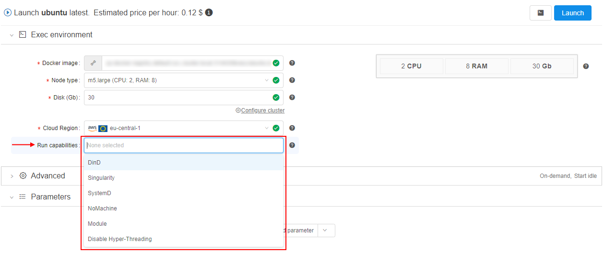
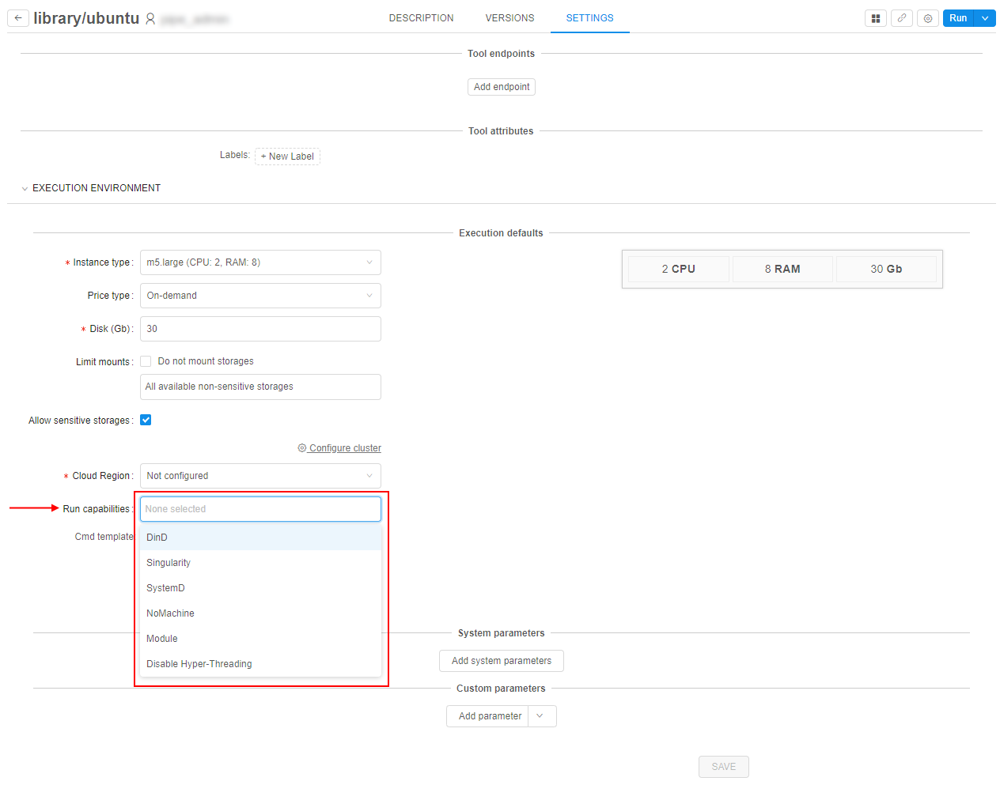
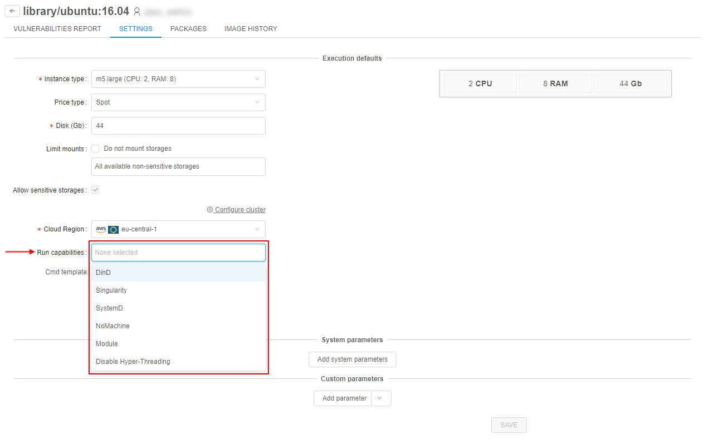
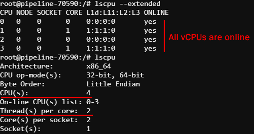
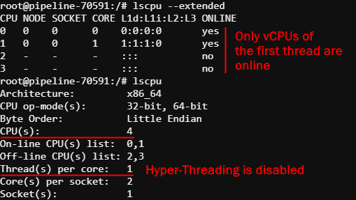
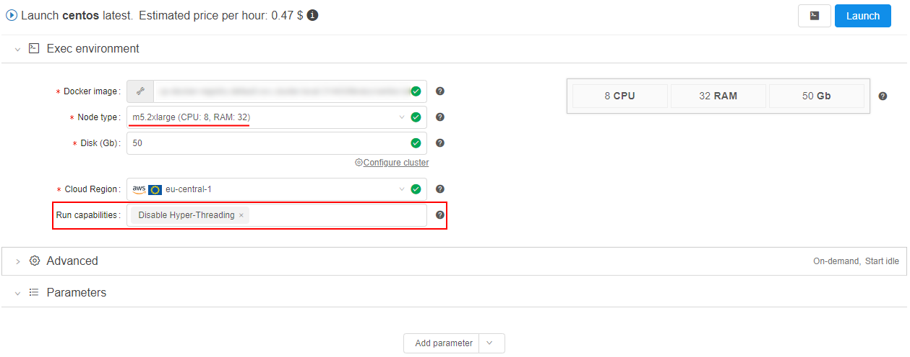
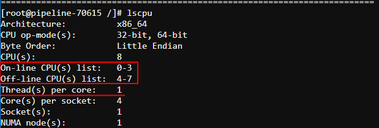

# 10.9. Run capabilities

- [Disable Hyper-Threading](#disable-hyper-threading)

Users always can launch tool runs with default settings (as they are configured in the tool/tool version's settings).  
On the other hand, there are cases when for the run specific custom settings shall be specified.  
In addition to the general frequently-used settings (like instance type and disk size), the platform allows you to customize special system behavior/capabilities.  
Some of these capabilities can be configured via System parameters, but more convenient way - to use the GUI control "**Run capabilities**" and select necessary items from the list.

Ways to set such capabilities for a **Tool** run:

- at the **Launch** page in the "Exec environment" section, before the run, e.g.:  
      
    In such case, selected capabilities will be applied only for the upcoming run.  
    **_Note_**: for a run, several capabilities can be selected (multi-select for the dropdown list is supported)
- at the **Tool** settings page, e.g.:  
      
    In such case, selected capabilities will be applied for all runs of that tool launched with default settings.  
    **_Note_**: several capabilities can be selected (multi-select for the dropdown list is supported)
- at the **Tool version's** settings page, e.g.:  
      
    In such case, selected capabilities will be applied for all runs of that tool version launched with default settings.  
    **_Note_**: several capabilities can be selected (multi-select for the dropdown list is supported)

> Same capabilities can be also configured for pipeline runs and detach configuration runs. In all cases the behavior is configured in the similar way - by the selecting of necessary items in the "**Run capabilities**" dropdown list before the run - in configuration or at the **Launch** page.

Below you can find descriptions and using examples of the separate capabilities.

## Disable Hyper-Threading

**Hyper-Threading technology** makes a single physical processor appear as multiple logical processors. To do this, there is one copy of the architecture state for each logical processor, and the logical processors share a single set of physical execution resources.

Hyper-Threading technology is enabled by default for Cloud instances launched in Cloud Pipeline deployment.  
But for some cases, users want to disable Hyper-Treading technology for specific runs as it may slow the computation.

So, this technology can be turned off via "**Run capabilities**", as is best for a particular application at the user's discretion.

**_Note_**: also the Hyper-Treading technology can be disabled manually by setting the parameter `CP_DISABLE_HYPER_THREADING` with `true` value before the run

> In Cloud Provider environment, each vCPU is a thread of a physical processor core. All cores of the instance has two threads. Disabling of Hyper-Threading disables the set of vCPUs that are relied to the second thread, set of first thread vCPUs stays enabled.
>
> For example, instance with enabled Hyper-Threading:  
> 
>
> The same instance with disabled Hyper-Threading:  
> 

Example of disabling Hyper-Threading:

1. Open any tool you wish to run with disabled Hyper-Threading.
2. Select "**Run**" → "**Custom settings**".
3. At the **Launch** page, expand the "**Exec environment**" section.
4. Set the instance type with several CPUs (we will use the instance with 8 CPUs).
5. Select the item "_Disable Hyper-Threading_" in the "**Run capabilities**" dropdown list:  
    
6. Launch the run.
7. Open the **Run logs** page of the just-launched run, expand the "**Parameters**" section:  
      
    Check that the parameter to disable Hyper-Threading was set.
8. Wait until the **SSH** hyperlink appears. Click it.
9. In the web-terminal perform the command `lscpu`:  
      
    Here you can check that Hyper-Threading is disabled (only 1 thread per core is set) and virtual CPUs 4-7 are offline. So, only one thread is enabled (set of CPUs 0-3).
